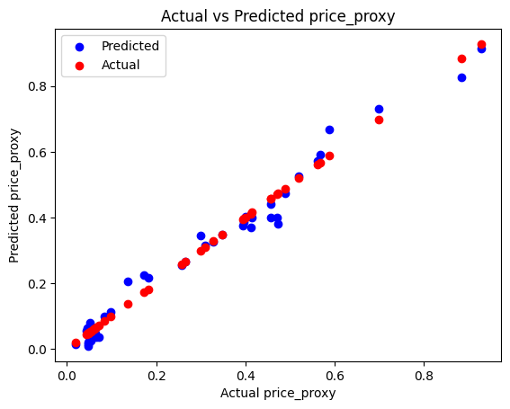

# Factors Infulencing US House price

**Task -** 
Using publically available data for the national factors that impact supply and demand of homes in US, build a model to study the effect of these variables on home prices.

## Approach: 

The following variables are chosen for the study-

- Interest rate
- Unemployment rate
- Population
- employment-population ratio
- GDP per Capita
- Housing unit started
- average rent price

As a proxy to the home prices, S&P CASE-SHILLER Index is used. 

## Performing EDA on the choosen features

Plotted a correlation matrix of all the columns
 

**avg_rent , gdp_per_capita , population have very high correlation with house price**

Performed Statistical Analysis on the given data to check relation of each feature with the target variable(price_proxy)

performed feature selection using recursive feature elimination to find the most important features.

**avg_rent , gdp_per_capita , population had the highest feature importance**

## Model Building

SINCE OUR TARGET VARIABLE (HOME PRICE INDEX) FOLLOW AN ALMOST LINEAR PATTERN LINEAR REGRESSION IS A GOOD FIT

using linear regression the following metrics were achieved:
Mean Squared Error: 0.0011643659387635447
R-squared (R2) Score: 0.979326390978005

More over each individual Feature was used for prediction to see their relation with the target variable

as a result we can say that Population , gdp-per-capita and average rent price have almost linear relation with price of house

Decision tree was also used to improve the performance of the model and we were able to achieve a R2-score of 0.992194 but inference is not possible using a decision tree.

Most of the data is downloaded from [https://fred.stlouisfed.org/].

Articles refered -

https://www.investopedia.com/articles/mortages-real-estate/11/factors-affecting-real-estate-market.asp

https://www.gsquarehousing.com/economic-factors-influencing-real-estate-investments/#:~:text=In%20conclusion%2C%20our%20exploration%20into,%2C%20inflation%2C%20and%20government%20policies.

https://www.kaggle.com/datasets/madhurpant/factors-affecting-usa-national-home-prices?select=Mortgage.csv

https://pvsbuilders.com/economic-factors-affecting-housing-market/

https://www.uslendingcompany.com/blog/the-9-largest-drivers-for-real-estate-property-growth-in-california/